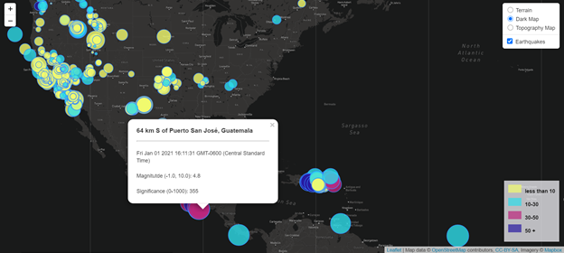

# Visualizing Data with Leaflet

1. **Retrieving a data set**

   The USGS provides earthquake data in a number of different formats, updated every 5 minutes. For the purpose of this project, the data set used was "The Past 7 days, All Eearthquakes" on the [USGS GeoJSON Feed](http://earthquake.usgs.gov/earthquakes/feed/v1.0/geojson.php) page.  

2. **Import & Visualize the Data**

   * Created a map using Leaflet that plots all of the earthquakes from the data set based on longitude and latitude.

   * Allowed data markers to reflect the magnitude of the earthquakes by size. Earthquakes with higher magnitudes appear larger. 
   
   * Allowed data markers to reflect the depth of the earthqakes by color. Earthquakes with greater depth appear darker in color.

   * Included popups that provide additional information about the earthquake when a marker is clicked.

   * Created a legend that will provide context for the map data.

   

   

   

### Copyright

Trilogy Education Services © 2019. All Rights Reserved.
